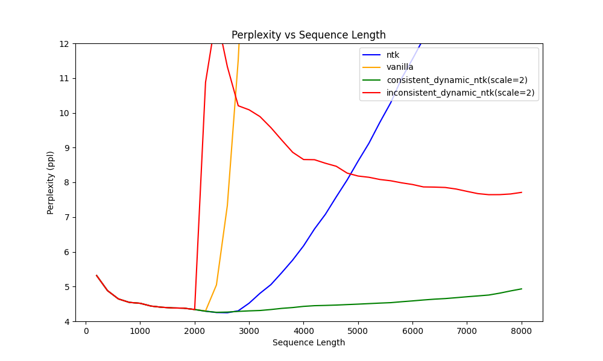

# Consistent Rotation Base for Dynamic NTK Scaling RoPE

## Inconsistent problem
Weeks ago, [u/emozilla](https://www.reddit.com/user/emozilla) proposed an improvement on NTK-Aware RoPR in this [post](https://www.reddit.com/r/LocalLLaMA/comments/14mrgpr/dynamically_scaled_rope_further_increases/), later named DynamicNTKScalingRotaryEmbedding. The main idea behind Dynamic NTK involves incorporating a scaling factor relative to the present decoding sequence length to improve the base functionality.
However, there is actually a subtle gap between how we compute perplexity and how the LLM actually generates tokens. 

If you are using the DynamicNTKRope implemented by [Huggingface](https://github.com/huggingface/transformers/blob/b257c46a075419c09e5ce5c5aa39bc346ecdb9a5/src/transformers/models/llama/modeling_llama.py#L147), the sequence length remains fixed when calculating perplexity, and no key cache is needed. As a result, there are no rotation base inconsistency between keys.

However, when LLM starts generation token by token beyond its maximum trained length, the sequence length increases and each key is continually pushed into the key-value cache. Consequently, we have such a rotation inconsistency between keys.

To put it clearly, while LLM decoding, the current DynamicNTKRope is implemented as


From my understanding, we should keep the rotation base consistent, which is:

When decoding `sequence length = seq2`


As decoding sequence length increases to `seq3`,


Please check [this post](https://www.reddit.com/r/LocalLLaMA/comments/155bexn/a_potential_rotation_inconsistency_of_dynamically/) for more details.


## How to use
```python

from transformers import AutoTokenizer, LlamaForCausalLM
import torch
from scale_rope.consistent_rope_for_llama_patch import replace_llama_attn_with_consistent_ntk_rope

model = LlamaForCausalLM.from_pretrained(PATH_TO_CONVERTED_WEIGHTS)
tokenizer = AutoTokenizer.from_pretrained(PATH_TO_CONVERTED_TOKENIZER)

prompt = "Hey, are you conscious? Can you talk to me?"
inputs = tokenizer(prompt, return_tensors="pt")

replace_llama_attn_with_consistent_ntk_rope()
# Generate
generate_ids = model.generate(inputs.input_ids, max_length=30)
tokenizer.batch_decode(generate_ids, skip_special_tokens=True, clean_up_tokenization_spaces=False)[0]

```

## Experiments
A patch, ``replace_llama_attn_with_inconsistent_ntk_rope_for_ppl`` is applied to bridge the gap between perplexity evaluation and decoding. You can find it in the directory ```scale_rope/inconsistent_rope_for_perplexity```. Please set ``inconsistent_dntk`` as ``True`` in ``eval_ppl.py``, to enable the patch.

The inconsistent_ntk patch changes the rotary computation on Key and Query as below:


Interestingly, as shown in the figure 1, when enabling the patch, the perplexity value of inconsistent Dynamic NTKScale RoPE significantly increases. However, as the sequence length continues to grow, we can find in Table 1 that the perplexity value gradually decreases. Notably, the inconsistent Dynamic NTKScale RoPE outperforms the NTKScale RoPE in perplexity when the sequence length exceeds 5,000.




**Table 1:** PPL Value of Different NTKScale Methods

| Lenth | Consistent Dynamic NTKScale PPL | Inconsistent Dynamic NTKScale PPL | NTKScale PPL          |
| ----- |---------------------------------|-----------------------------------| ---------------- |
| 2800  | 4.285102386474609               | 10.203343925476075                | 4.301338438987732 |
| 3600  | 4.371902356147766               | 9.213108296394347                 | 5.401671919822693 |
| 5600  | 4.536222472190857               | 8.04413757801056                  | 10.291163015365601 |
| 7200  | 4.7303602981567385              | 7.674421100616455                 | 15.359781618118285 |
| 8000  | 4.932255864143372               | 7.7100021314620975                | 15.884212293624877 |

